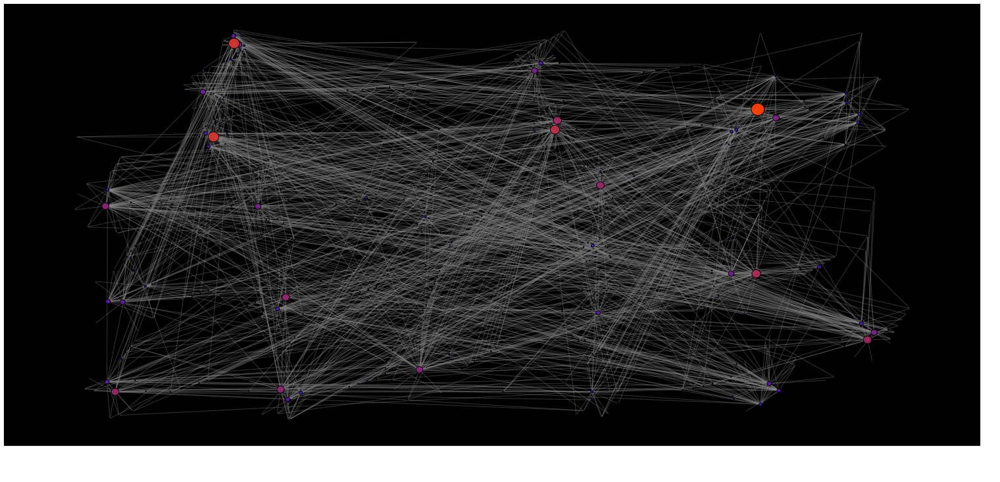
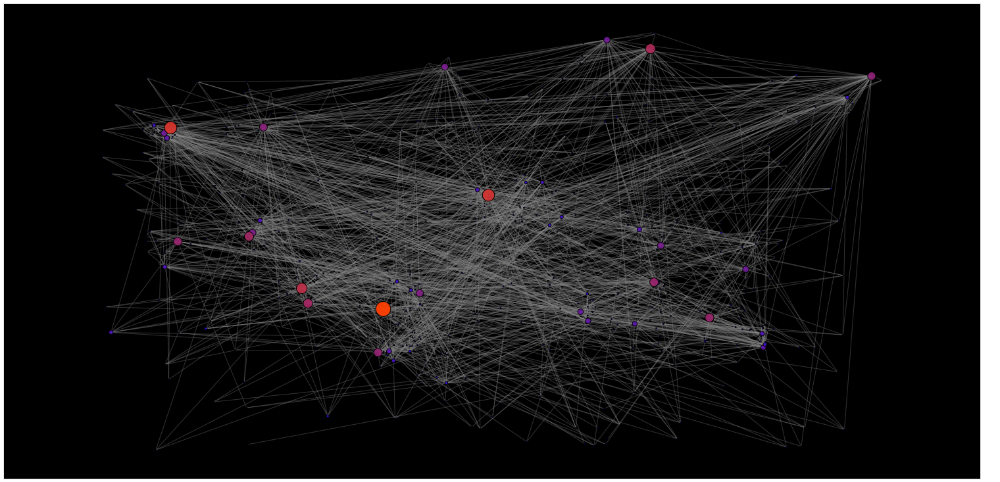

# Проект Тераграф. Программа на основе тестового примера проекта BTWC RiscV в составе Graph Rocessor Core

## Общее описание

Проект BTWC для взаимодействия HOST систем с Graph Processor Core (XRT Runtime версия), используются аппаратные FIFO буферы по 512 слов и память External Memory.

## Установка

Для установки требуется рекурсивно клонировать репозиторий:

```bash
git clone --recursive https://github.com/Inspirate789/bmstu-teragraph-hackathon-2022.git
```

## Зависимости

Зависимости для сборки проекта:

* набор средст сборки [riscv toolchain](https://gitlab.com/quantr/toolchain/riscv-gnu-toolchain) и экспорт исполняемых файлов в `PATH`

* набор библиотек [picolib](https://github.com/picolibc/picolibc) и экспорт в `C_INCLUDE_PATH`

* исходный текст проекта [taiga](https://github.gitop.top/taiga-project/taiga) и экспорт в переменную окружения `TAIGA_DIR`

* библиотека [xrt](https://gitlab.com/xilinx4jet/XRT) и установка по пути `/opt/xilinx/xrt`

Для стандартного пользователя ВМ студенческой команды хакатона все необходимые переменные окружения установлены по-умолчанию.

## Сборка проекта

Следует выполнить команду:

```bash
cd task_2
make
```

Результатом выполнения команды станет файлы host_main, sw_kernel_main.rawbinary и leonhard_2cores_267mhz.xclbin в директории проекта верхнего уровня.

| :exclamation:  Не забывайте синхронизировать тексты исходного текста host и kernel составляющих проекта |
|---------------------------------------------------------------------------------------------------------|

## Запуск проекта (**Вариант 19**)
Берём ваш файл, добавляем его в проект и послединим аргументом при запуске программы указываем путь к нему из корня проекта:
```
./host/host_main leonhard_2cores_267mhz.xclbin ./sw-kernel/sw_kernel.rawbinary data/simulated_blockmodel_graph_500_nodes_snowball_10.tsv
```

Для выбора варианта раскладки графа необходимо указать в файле ./host/src/host_main.cpp один из вариантов:

Разсладка сообществ с помощью иерархического объединения и укладки в боксы:
```
#define BOX_LAYOUT
//#define FORCED_LAYOUT
```

или

Раскладка сообществ с помощью силового алгоритма Фрухтермана-Рейнгольда:

```
//#define BOX_LAYOUT
#define FORCED_LAYOUT
```

## Запуск сервера bokeh

После запуска проекта host будет открыт WebSocket на порту 0x4747. 

```bash
Group #0 	Core #0
	Software Kernel Version:	0x0000001a
	Leonhard Status Register:	0x00300001_09110611

DISC system speed test v3.0
Start at local date: 02.10.2022.; local time: 13.36.03

Test                                                             value          units
-------------------------------------------------------------------------------------
Graph Processing Cores count (GPCC)                                  1      instances
-------------------------------------------------------------------------------------
Leonhard clock frequency (LNH_CF)                                  240            MHz
-------------------------------------------------------------------------------------
Data graph created!

BTWC is done for 0.00 seconds
Create visualisation
I этап: инициализация временных структур
Количество сообществ в очереди 3580 и в структуре сообществ 213
Количество вершин в графе 213
II этап: выделение сообществ
III этап: построение дерева сообществ
IV этап: выделение прямоугольных областей
V этап: определение координат вершин
Wait for connections
```
Далее можно запустить сервер **bokeh** в одугом терминале, выполняющий визуализацию графа. Для этого :

```bash
cd bokeh
./start_33000.sh btwc.py
```

В итоге будет получена ссылка на визуализацию случайного графа:
```
Starting Bokeh server version 2.4.3 (running on Tornado 6.1)
User authentication hooks NOT provided (default user enabled)
Bokeh app running at: http://195.19.32.95:33000/btwc
Starting Bokeh server with process id: 65483
```
Если копия сервера уже запущена на данном порту 33000, то вы можете указать в файле start_33000.sh другой свобобный порт.
```
Starting Bokeh server version 2.4.3 (running on Tornado 6.1)
Cannot start Bokeh server, port 33000 is already in use
```
Укажем порт 33001 и перезапустим сервер:
```
./start_33000.sh btwc.py
```
В результате по указанной ссылке будет визуализирован граф, заданный в файле по варианту (19):
- Разсладка сообществ с помощью иерархического объединения и укладки в боксы (`BOX_LAYOUT`):

- Разсладка сообществ с помощью силового алгоритма Фрухтермана-Рейнгольда (`FORCED_LAYOUT`):


## Очистка проекта

Следует выполнить команду:

```bash
make clean
```
